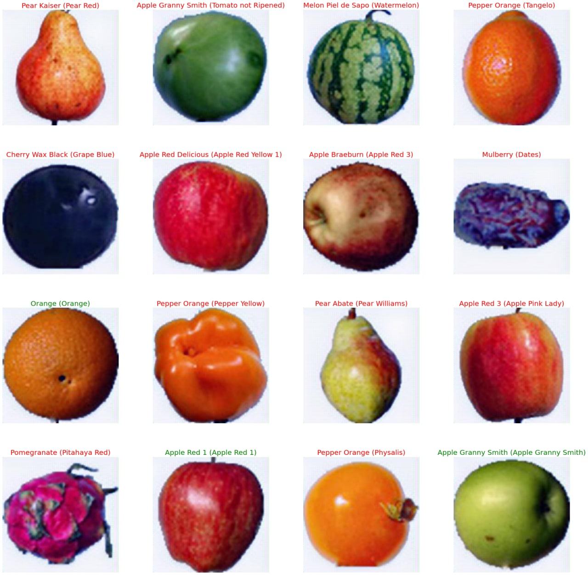

# CLIP_experimental
---
This repository contains experiments and results of comparison of image features extractors generated by classical training on ImageNet and CLIP[[paper](link.to.paper)] training procedure on a specific [Fruits](link.to.dataset) dataset.

### **Zero-shot preditions**
The procedure described in the CLIP [paper](link.to.paper) allows to make predictions on a new image dataset with any set of labels without training.
<p align="center"></p>

We compared features extractors with different architectures and training procedures:
1. Zero-shot of CLIP with ViT/ResNet
2. K-shot of CLIP with ViT/ResNet
3. Linear probing of CLIP with ViT/ResNet
4. Linear probing of ViT/ResNet trained on ImageNet
5. Fine-tuning of CLIP with ViT/ResNet
6. Fine-tuning of ViT/ResNet trained in ImageNet

We also compared 2 image upsampling options:
 - Bucubic interpolations
 - SRGAN upsampling

Main plots can be found in the [results](#results) section. Full experiments descriptions can be found in the ```report.pdf```

## Repository structure
---
qweasdgozxcclown


## Results
---
### K-shot training
Pretained CLIP model with new fully-connected layer which is trained only on *k* examples of each class.
<p align="center"></p>

### Linear probing
Pretained model with new fully-connected layer which is trained on a training part of the target dataset.
<p align="center"></p>
<p align="center"></p>

### Fine-tuning
Fune-tuning of models pretrained on ImageNet and CLIP with respective training procedures on the target dataset
<p align="center"></p>

### Upsampling
<p align="center"></p>

Repository for experiments with several approaches to fine-tune model, pretrained on the CLIP:  https://openai.com/blog/clip/

SRGAN [Weights](https://drive.google.com/drive/folders/1-_0wNvmjFnISr_lN520DfqyqN3uydgFC?usp=sharing)
