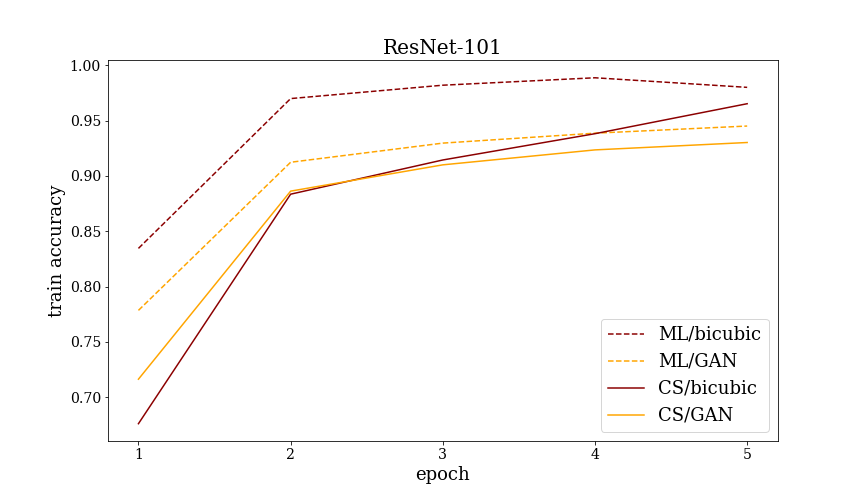

# Evaluation of CLIP image feature extractors
This repository contains experiments and results of comparison of image features extractors generated by classical training on ImageNet and CLIP[[paper](https://arxiv.org/abs/2103.00020)][[repo](https://github.com/openai/CLIP)][[blog](https://openai.com/blog/clip/)] training procedure on a specific [Fruits-360](https://www.kaggle.com/moltean/fruits) dataset.

### **Zero-shot prediсtions**
The procedure described in the CLIP [paper](https://arxiv.org/abs/2103.00020) allows to make predictions on a new image dataset with any set of labels without training. Example of zero-shot predictions on [Sports-72](https://www.kaggle.com/gpiosenka/sports-classification) dataset.
Caption format: **Predicted (True)**
<p align="center"></p>


## Experiments accomplished
We compared features extractors with different architectures, training procedures and image upsampling techniques. If an image upsampling technique is not mentioned, then bicubic interpolation is used. We performed the following two main sections of experiments:
1. Linear probing and fine-tuning of CLIP with ResNet and ViT backbones and ImageNet-pretrained ResNet and EfficientNet
2. Zero-shot and K-shot classification of CLIP with ViT and ResNet backbones

We also compared 2 image upsampling options:
 - Bucubic interpolations
 - SRGAN upsampling [[weights](https://drive.google.com/drive/folders/1-_0wNvmjFnISr_lN520DfqyqN3uydgFC?usp=sharing)]

We did it on the following training setups: linear probing and contrastive fine-tuning of CLIP with ResNet and ViT backbones.

Main plots can be found in the [results](#results) section. Full experiments descriptions can be found in the ```supplementary/report.pdf```

## Repository structure
- ```notebooks/``` — contains experiments in form of jupyter notebooks \
    ```├── few_shot_learning.ipynb``` — k-shot learning procedure\
    ```├── image_upsampling.ipynb``` — two ways to upsample images with subsequent saving\
    ```├── prompts_validation.ipynb``` — finding the best prompt for given dataset\
    ```├── train_ImageNet_models.ipynb``` — fine-tuning of models pretrained on ImageNet in different settings\
    ```└── train_CLIP.ipynb``` — fine-tuning CLIP models in different settings
- ```data_prepare/``` — dataset upsampling auxilary source code
- ```src/``` — training related auxilary source code
- ```pics/``` — pictures for the [results](#results) part
- ```supplementary/``` — contains report and presentation in ```.pdf``` format


## Results
### Zero-shot predictions
We tested zero-shot prediction performance of CLIP on a number of domain-specific datasets. These are [Birds-270](https://www.kaggle.com/gpiosenka/100-bird-species), [Simpsons characters](https://www.kaggle.com/alexattia/the-simpsons-characters-dataset), [Sports-72](https://www.kaggle.com/gpiosenka/sports-classification), [Fruits-360](https://www.kaggle.com/moltean/fruits). Here are some examples of the predictions:
#### **Simpsons characters** [[link](https://www.kaggle.com/alexattia/the-simpsons-characters-dataset)] ~ 0.51 accuracy
---
<p align="center"></p>

#### **Birds-270** [[link](https://www.kaggle.com/gpiosenka/100-bird-species)] ~ 0.52 accuracy
---
<p align="center"></p>

#### **Fruits-360** [[link](https://www.kaggle.com/moltean/fruits)] ~ 0.24 accuracy
---
<p align="center"></p>

#### **Sports-72** [[link](https://www.kaggle.com/gpiosenka/sports-classification)] ~ 0.79 accuracy
---
<p align="center"></p>


### K-shot training
Pretained CLIP model with ResNet-101 backbone + new fully-connected layer which is trained only on *k* examples of each class.
<p align="center"></p>

### Fine-tuning with linear probing
Fune-tuning of visual parts of CLIP models with linear classifier on top with frozen/trainable backbones

<p align="center"> </p> 


### Fine-tuning CLIP with different upsamplings
Fine-tuning CLIP visual models using different methods and upsamplings.
1. Maximizing likelihood (ML), i.e. training CLIP visual model + a linear layer on top
2. Cosine Similarity maximizing (CS). Fine-tune CLIP visual model to maximize cosine similarity between images of the same class.

Each method was tested with ResNet-101/ViT backbones and bicubic/GAN upsampling
<p align="center"> </p> 
<p align="center"> </p> 

